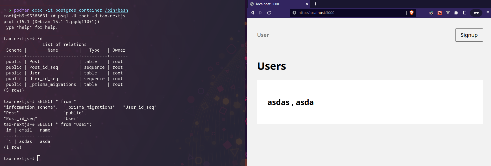

# Tax automation

Starting steps:-
1. To start the postgres database -> `docker-compose up -d`
2. Run `npx prisma migrate dev --name init` to sync the prisma scheme and the database tables
3. Then use `yarn dev` to start the server at 3000

Getting access to the database through terminal:-
1. Start a shell with `docker exec -it postgres_container /bin/bash`
2. Use the `psql -U root -d tax-nextjs` command to connect with database

Post Gres common commands:-
1. \d to get the list of tables in the current database
2. SELECT * from "Table Name" To get the content of table
